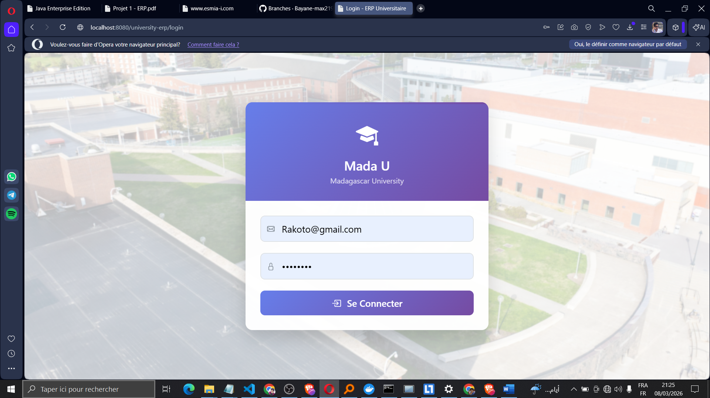
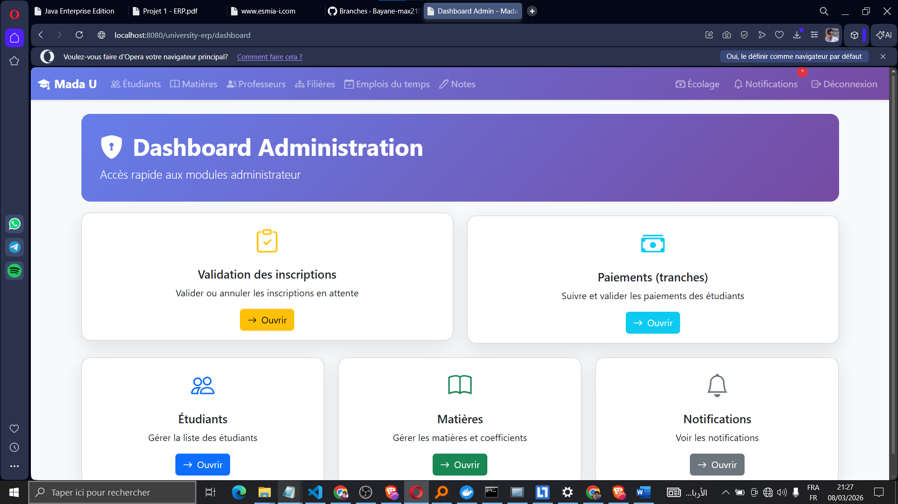
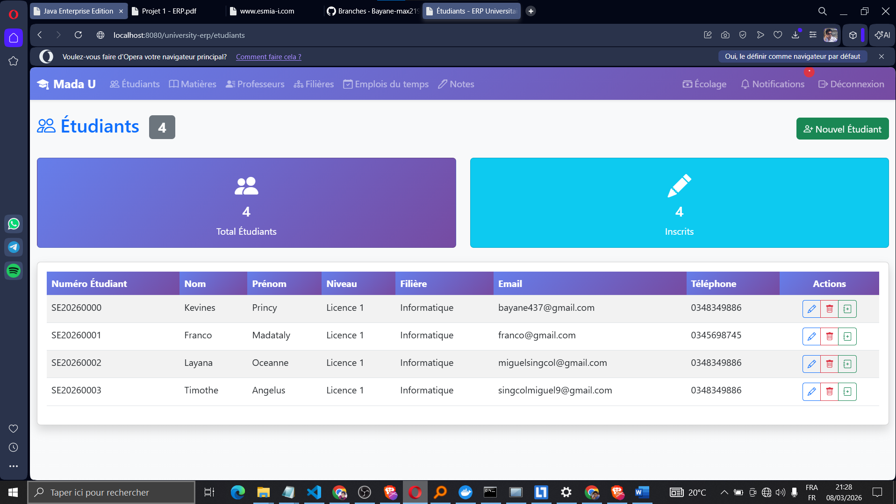
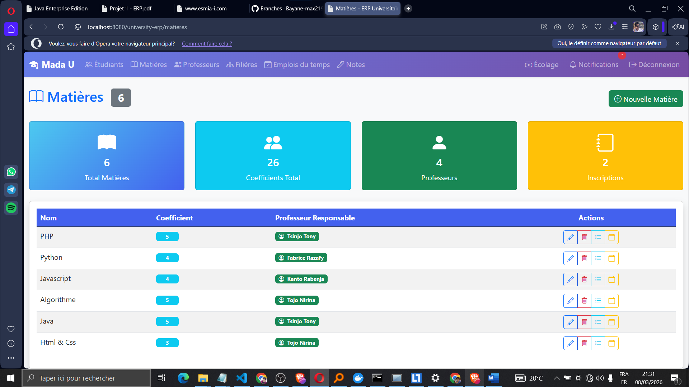
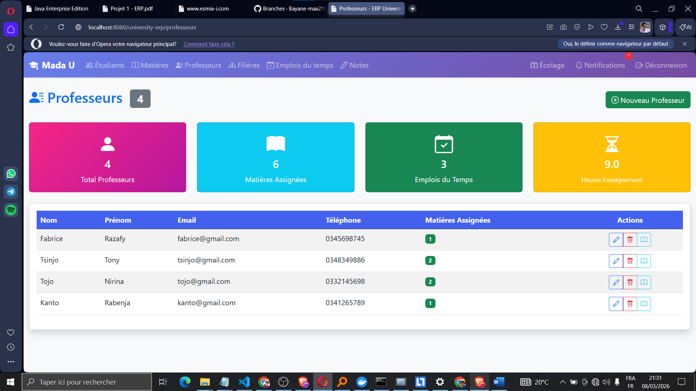
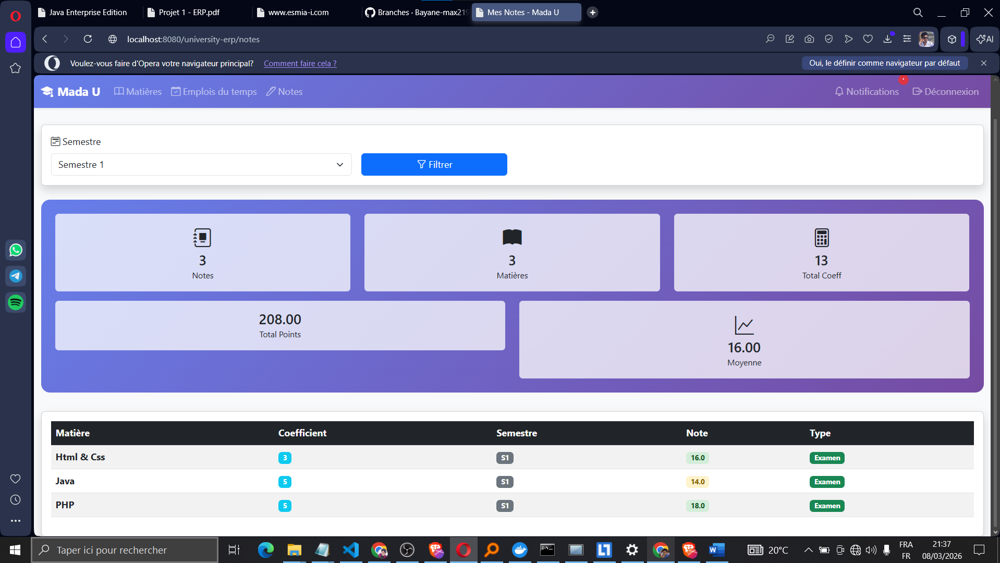
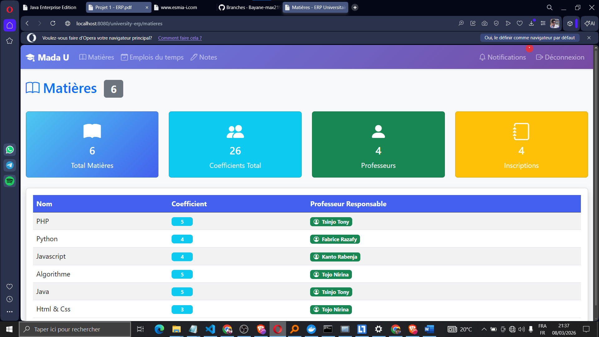
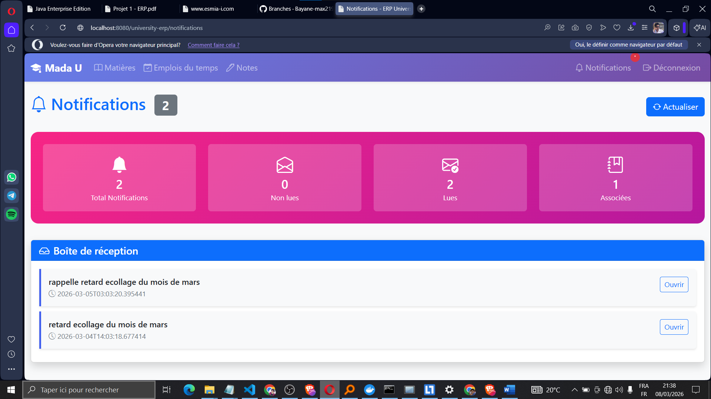
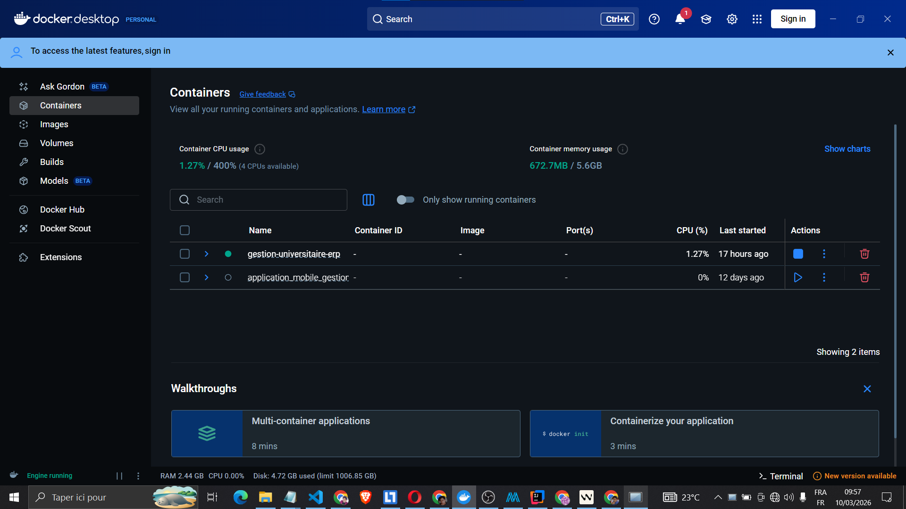
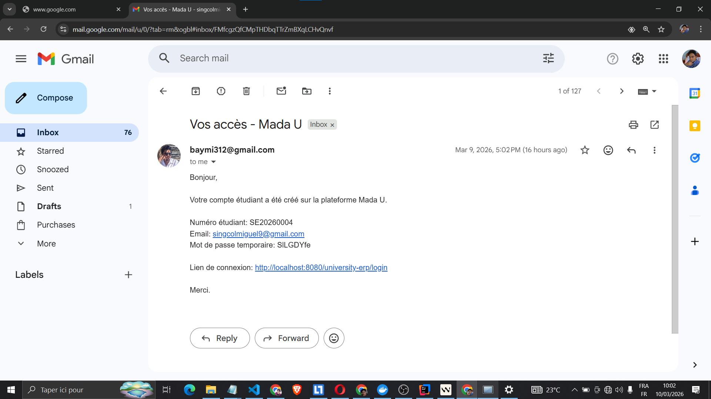

# Gestion-universitaire-ERP
Mini-système ERP pour gestion universitaire en JEE/JPA/JSF

## Démarrage rapide (Docker)

### Prérequis

- Docker Desktop (avec Docker Compose)

### Lancer l'application

```bash
docker compose up --build
```

### Accès

- Application : http://localhost:8080/university-erp/
- Login : http://localhost:8080/university-erp/login

### Base de données

- MySQL exposé sur le port `3307` (sur la machine hôte)
- DB : `gestion_universitaire_db`
- User : `root`
- Password : `root`

Le script d'initialisation est dans : `Base_de_données/gestion_universitaire_db.sql`.

## Screenshots











